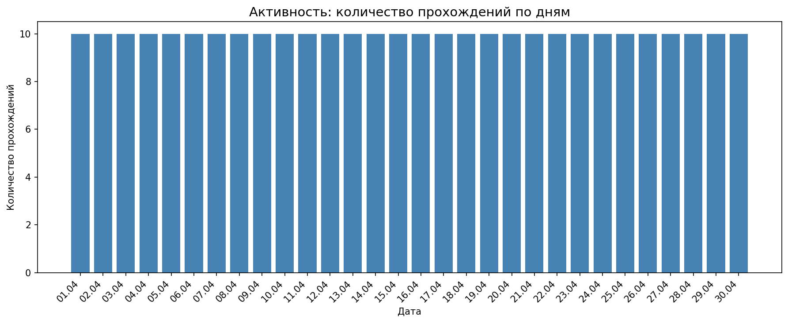
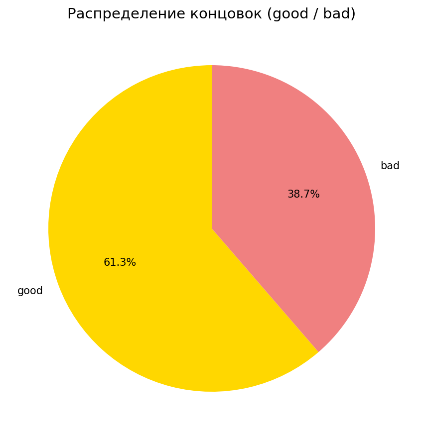
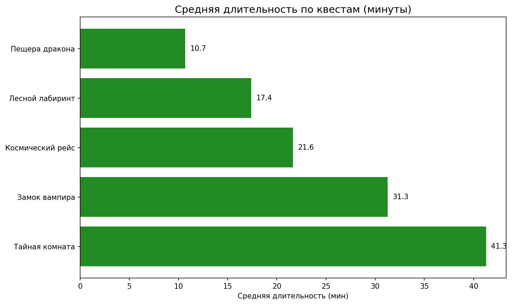
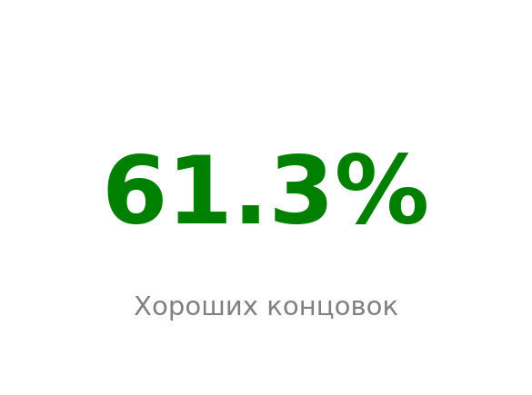

# 📊 Дашборд аналитики квестов

Дашборд построен на синтетических данных игровых сессий (CSV). Графики генерируются скриптом на **Python**, **Pandas** и **Matplotlib** и сохраняются в PNG для портфолио и README.

## О проекте

Источник данных: файл [`data/game_sessions.csv`](data/game_sessions.csv) — табличный учёт прохождений по дням с полями дата, квест, концовка (`good` / `bad`), длительность в минутах и игрок.

Текущий датасет — **апрель 2026**, **300 записей**, **5 квестов** (в том числе «Тайная комната»).

## Метрики (по текущему CSV)

| Показатель | Значение |
|------------|----------|
| Всего прохождений (строк в CSV) | 300 |
| Уникальных значений в колонке «игрок» | 8 |
| Число квестов | 5 |
| Доля концовок **good** | около **61 %** (пересчитывается скриптом из файла) |

После замены данных в `game_sessions.csv` перезапустите генератор и при необходимости обновите текст метрик здесь вручную.

## Графики

На GitHub картинки подтягиваются из папки [`screenshots/`](screenshots/) относительно этого README.

| График | Что показывает |
|--------|----------------|
|  | Количество прохождений по календарным дням |
|  | Доли **good** и **bad** |
|  | Средняя длительность (мин) по каждому квесту |
|  | Один показатель: процент **good** |

## Как воспроизвести

Из корня репозитория:

```bash
cd dashboard/python
pip install pandas matplotlib
python dashboard_generator.py
```

После выполнения обновятся файлы `screenshots/chart_*.png`.

## Формат CSV

Разделитель полей — **табуляция**. Имена колонок (порядок не важен для скрипта): `Дата`, `Квест`, `Концовка`, `Длительность_мин`, `Игрок`. Дата в формате `ДД.ММ.ГГГГ`.
